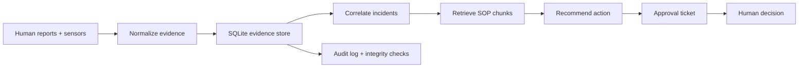

# NIRBHAR

NIRBHAR is a locally-run Sovereign AI safety copilot for a campus environment. It ingests human reports and sensor data, correlates them into incidents, retrieves relevant SOP guidance, stores an append-only audit chain, and requires explicit human approval before any action is recorded or dispatched.

The system is designed to remain offline, transparent, and privacy-preserving: no cloud APIs, no external telemetry, and no autonomous action without a human decision.

## Architecture

The core pipeline is:

Data -> Knowledge -> Memory -> Reasoning -> Action

### Pipeline overview

- Data: report and sensor inputs are normalized into a common evidence schema.
- Knowledge: markdown SOP packs are loaded from the local repository and scored for relevance.
- Memory: evidence and incidents are stored in SQLite with an append-only audit log.
- Reasoning: evidence is correlated into incidents and recommendations are generated from retrieved SOP sections.
- Action: the app creates approval-based tickets, never acting without a human decision.

## Repository structure

- app/: application logic for config, DB, intake, knowledge, correlation, approval, and API routes
- sop_packs/: campus and factory safety policy packs in markdown
- static/: browser UI for the demo dashboard
- tests/: phase-based regression tests
- scripts/: local environment setup helpers
- data/: SQLite database and local runtime artifacts

## Local stack

- Python 3.11+
- FastAPI + Uvicorn
- SQLite (stdlib)
- Pydantic v2
- Pytest
- local Ollama models for optional LLM embeddings and retrieval support

## Quick start

1. Create and activate a virtual environment if needed.
2. Install dependencies:

   python -m pip install -r requirements.txt

3. Optionally prepare local Ollama models:

   bash scripts/setup_ollama.sh

4. Start the API:

   python -m uvicorn app.main:app --host 0.0.0.0 --port 8000 --reload

5. Open the dashboard:

   http://localhost:8000/

## Demo flow

1. Load the seeded scenario:

   POST /api/demo/load

2. View incidents and live evidence in the dashboard.
3. Activate another SOP pack if desired:

   POST /api/pack/activate with {"pack": "factory"}

4. Submit a knowledge query:

   POST /api/knowledge/retrieve

5. Review the audit trail integrity:

   GET /api/audit/verify

6. Create an approval decision for an incident:

   POST /api/incidents/{incident_id}/approve

## Safety model

NIRBHAR is intentionally designed around a human-over-the-loop control flow:

- It collects and correlates evidence.
- It proposes recommendations from the local SOP set.
- It records audit events append-only.
- It creates approval tickets rather than acting autonomously.

This prevents unsafe action without explicit oversight.

## Example architecture diagram

## Testing

Run the full suite:

pytest -q

The project includes phase-based regression tests covering the data layer, knowledge retrieval, incident correlation, approval workflows, demo mode, and stretch features such as graphing, heatmaps, role views, and memory search.

## Stretch features implemented

- Graph view of evidence relationships
- Heatmap-style risk summary
- Factory SOP pack activation and retrieval
- Role-specific incident views
- Memory search against prior evidence and incidents

## Future work

- Add richer UI filters and drill-down views
- Move from keyword matching to better semantic retrieval over local embeddings
- Add persistent operator roles and authentication
- Support configuration-driven campus policy packs
- Extend the audit trail with signed event export and tamper reporting

## Notes

This repository is intentionally local-first and offline-safe. It is intended as a governance demo and a reference design for a sovereign AI workflow in a campus safety context.
